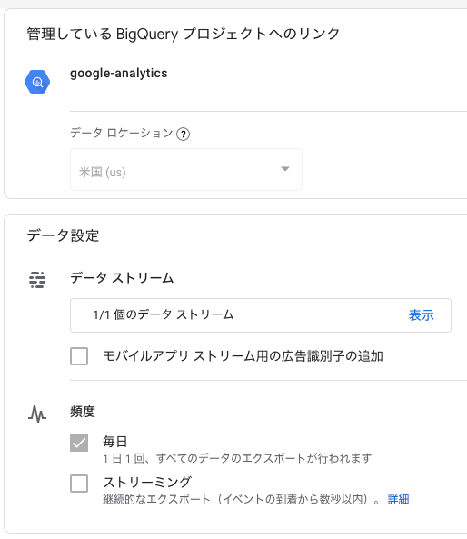
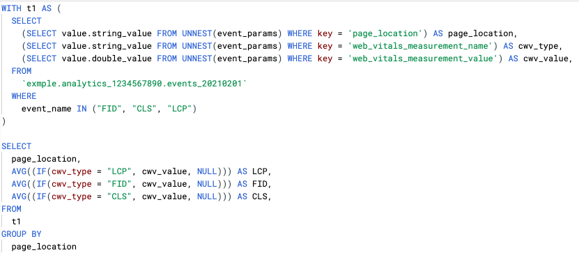
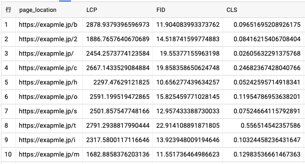
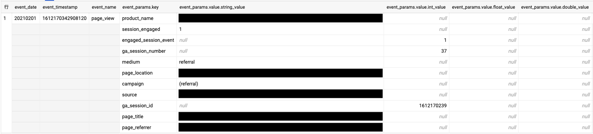
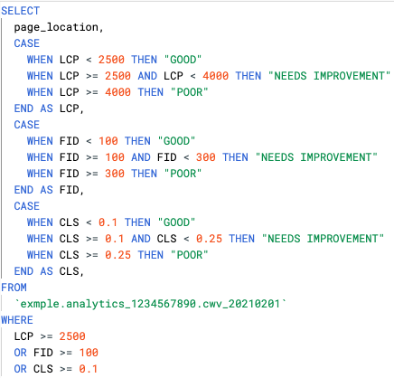
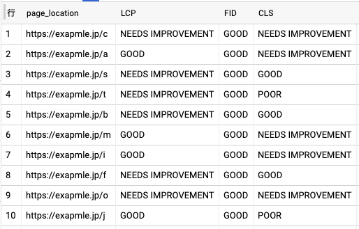

<!-- _class: title -->

# **GA4** で   __Core Web Vitals__ を計測して   __BigQuery__ で分析する

---
<!-- class: slides -->

### 太田 泰弘

株式会社マネーフォワード
CTO室 データ分析基盤グループ リーダー

データエンジニア

[@yshr1200](https://twitter.com/yshr1200)

---

## アジェンダ

1. GA4とは
1. GA4とBigQuery
1. Core Web Vitalsとは
1. Core Web Vitalsの値をGA4で計測する
1. [BigQuery] ページ毎のCore Web Vitalsの値を取得する
1. [BigQuery] 改善すべきページを洗い出す

---

## GA4とは

次世代の Google アナリティクス

---

- 2020年10月リリース
- アプリとウェブのクロスプラットフォーム計測
- イベント単位の計測方式
  - 従来のセッション単位の計測方式から大幅変更
- プライバシーに配慮
  - GDPR, CCPA, ITPなどに配慮した設計
- **BigQueryに生データを転送可能**

参考: https://support.google.com/analytics/answer/10089681

---

## GA4とBigQuery

- 集計前の「生データ」を無償で **BigQuery** に転送可能
  - GCPの利用料金は別途発生する
- 従来のGAでは「生データ」をBigQueryに格納する機能は有償版でのみ利用可能
  - より多くのユーザが「生データ」を利用出来るようになった

---

### BigQueryとのリンク設定

- 事前にBigQueryを有効にしたGCPプロジェクトを用意
- GA4管理画面より数クリックで設定可能
  - リンク先GCPプロジェクト
  - データロケーション
  - 転送するデータ
    - ウェブのみ、アプリのみ、ウェブアプリすべてなどの選択が可能
  - 転送頻度

---

---

## Core Web Vitalsとは

> ウェブで優れたUXを実現するために重要と思われる品質シグナルの統合ガイドを提供する取り組みです。

この取り組み（Web Vitals）で核となる指標群が  **Core Web Vitals** です。
2021年5月以降、検索ランキングにおいてCore Web Vitalsが評価されると発表されています。

---

### Core Web Vitalsの3つの指標

- **LCP**（Largest Contentful Paint）
  - 読み込み時間
- **FID**（First Input Delay）
  - インタラクティブ性
- **CLS**（Cumulative Layout Shift）
  - ページコンテンツの視覚的な安定性

---

### LCP

- ページ内のメインコンテンツの**レンダリング時間**を指す
  - GOOD
    - 2.5秒未満
  - NEEDS IMPROVEMENT
    - 2.5秒以上4.0秒未満
  - POOR
    - 4.0秒以上

---

### FID

- ページ内でユーザーが最初のアクションを起こしてから応答するまでの時間を指す
  - GOOD
    - 100ミリ秒未満
  - NEEDS IMPROVEMENT
    - 100ミリ秒以上300ミリ秒未満
  - POOR
    - 300ミリ秒以上

---

### CLS

- 予期せぬレイアウトのズレを指す（ズレが生じた表示領域の比率 × 距離の比率）
  - GOOD
    - 0.1未満
  - NEEDS IMPROVEMENT
    - 0.1以上0.25未満
  - POOR
    - 0.25以上

---

## Core Web VitalsをGA4で計測する

- Google Tag Managerのカスタムタグテンプレートを使用してCore Web Vitalsの各指標をイベントとして計測する
- 設定方法
  - [Track Core Web Vitals In GA4 With Google Tag Manager | Simo Ahava's blog](https://www.simoahava.com/analytics/track-core-web-vitals-in-ga4-with-google-tag-manager/)
    - Simo Ahava氏(GDE for Google Analytics and Google Tag Manager)のブログ

---

## [BigQuery] ページ毎のCore Web Vitalsの値を取得する

---

- ページ別の3指標（LCP, FID, CLS）の平均値をBigQueryで取得しましょう。
  - LCP, FIDの値はいずれもミリ秒単位で格納されています。

---

[SQLファイルはこちら]()

---

---

**ポイント**

- 転送されるテーブルは**日付別テーブル**
  - 対象のプロパティ毎にデータセットが作成され、**events_YYYYMMDD**という名前のテーブルが作成される
---

**ポイント**

- テーブルの各行は**イベント単位**で、**ネスト**される形で**イベントパラメータ**が格納される
  - event_parameter.keyに各イベントパラメータの名前が格納される
  - event_parameter.value以下に各イベントパラメータの値が格納される
    - 値の型によりstring_value, int_value, float_value, double_valueなど格納されるカラムが異なる

---

例: ページビューイベント

---

## [BigQuery] 改善すべきページを洗い出す

---

- LCP, FID, CLSの3指標がオールGOODでないページは改善する余地があります。
- 前項で各指標のページ別平均値を取得したテーブルを基にオールGOODでないページの一覧を取得します。

---

[SQLファイルはこちら]()

---

---

## まとめ

- GA4のリリースによりBigQueryを用いた詳細なアクセス解析が無償版ユーザーでも可能になった
  - 従来のGAでは出来なかったようなより詳細な分析をサンプリングを気にせずおこなえる
- Core Web Vitalsに限らず、カスタムイベントを増やすことで柔軟なアクセス解析が可能
- ウェブとアプリを跨いだ分析が可能
